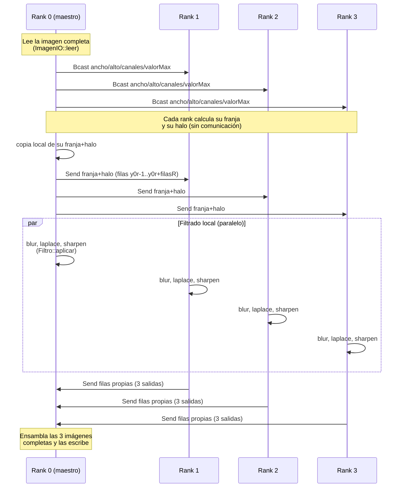

# Fase 4 — Diseño 4: Memoria distribuida (`mpi_filterer`, Docker + MPI)

Fecha: 2026-10-05
Rama: `diseno-4` (parte de `diseno-3`)

No fue necesario pedir ningún comando `sudo`: el usuario ya pertenecía al
grupo `docker` (verificado en la Fase 0) y el servicio Docker ya estaba
activo, así que todo el trabajo de esta fase (`docker compose build/up/
exec/down`) se hizo sin privilegios de administrador.

## 1. Qué se hizo

- `src/mpi_filterer.cpp` + `include/ParticionMPI.h`/`src/ParticionMPI.cpp`:
  el ejecutable MPI del diseño 4.
- `Dockerfile`: imagen única (Ubuntu 24.04 + g++/make + OpenMPI +
  OpenSSH) usada por los 4 nodos del clúster.
- `docker-compose.yml`: 1 nodo `maestro` + 3 `trabajador1/2/3`, red interna
  de Docker, volumen compartido con el proyecto (sufijo `:z` por SELinux).
- `hostfile`: lista de nodos para `mpirun`.
- `run_mpi.sh`: compila y lanza `mpirun`, en modo `local` (un contenedor,
  sin SSH) o `cluster` (entre contenedores, con hostfile + SSH).

## 2. Arquitectura de `mpi_filterer`

Reutiliza exactamente el mismo `Filtro::aplicar(entrada, salida,
y0,y1,x0,x1)` de los diseños 2 y 3 — ningún rank reimplementa la
convolución. La idea central: cada rank construye su **propia franja local**
como un objeto `Imagen` (`PGMImagen`/`PPMImagen`, el mismo tipo concreto que
la imagen original) que incluye las filas fantasma (halo) que necesita, y
le pasa ESE objeto local a `Filtro::aplicar` — exactamente la misma llamada
que usarían `filterer` o `th_filterer`, solo que sobre una imagen más
pequeña (la franja) en vez de la imagen completa.

### 2.1 Partición determinista (sin comunicación)

`calcularParticion(alto, size, rank, &y0, &filas)` (`src/ParticionMPI.cpp`)
reparte las `alto` filas entre `size` ranks con división entera y reparte
el resto entre los primeros ranks (igual idea que la repartición de carga
de `th_filterer` en la Fase 3, pero generalizada a N particiones en vez de
4 fijas). Es una función pura, **sin llamadas MPI**: todos los ranks la
ejecutan con los mismos argumentos (`alto` y `size` llegan por
`MPI_Bcast`) y obtienen el mismo resultado sin necesidad de que rank 0 se
lo comunique — ahorra mensajes.

### 2.2 Halo de 1 fila

Para cada rank, además de sus `filas` propias `[y0, y0+filas)`, se calcula
si necesita una fila fantasma arriba (`y0>0`) y/o abajo (`y0+filas<alto`).
El buffer local que viaja por red cubre
`[y0 - haloArriba, y0+filas + haloAbajo)`. Dentro de ese buffer local,
`offsetReal` marca dónde empiezan las filas "propias" (0 si no hay halo
arriba, 1 si lo hay). `Filtro::aplicar` se invoca con
`y0=offsetReal, y1=offsetReal+filas`, así que **lee** las filas de halo
(para resolver los vecinos de las filas del borde de su franja) pero
**escribe** únicamente sus filas propias — el mismo patrón de "región
disjunta de escritura, lectura más amplia" que ya usaban `th_filterer` y
`omp_filterer` en la Fase 3, ahora a través de la red en vez de memoria
compartida.

### 2.3 Flujo completo

1. Rank 0 lee la imagen completa (`ImagenIO::leer`) y difunde
   (`MPI_Bcast`) ancho/alto/canales/valorMax a todos los ranks.
2. Cada rank calcula su partición y halo (determinista, sección 2.1).
3. Rank 0 copia su propia franja directamente (sin enviarse un mensaje a
   sí mismo) y envía (`MPI_Send`) la franja-con-halo correspondiente a
   cada rank 1..N-1; cada uno la recibe con `MPI_Recv`.
4. Cada rank aplica blur, laplace y sharpen (los tres obligatorios) a su
   franja con `Filtro::aplicar`, midiendo el tiempo con `Temporizador`.
5. Cada rank devuelve (`MPI_Send`) sus filas propias (sin halo) de las 3
   salidas a rank 0; rank 0 las recibe (`MPI_Recv`) y las ensambla en 3
   imágenes completas.
6. Rank 0 escribe `salida_blur`, `salida_laplace`, `salida_sharpen`.
7. **Cada rank imprime su propia línea** con tiempo de filtrado y de
   comunicación (real y CPU), sección 6.

### 2.4 Diagrama de comunicación



## 3. Infraestructura Docker

### 3.1 Dockerfile

Imagen única (todos los nodos son simétricos): Ubuntu 24.04 + `g++`/`make`
+ `openmpi-bin`/`libopenmpi-dev` + `openssh-server`/`openssh-client`. En el
build se genera **un solo par de llaves SSH** (`ssh-keygen`) y se agrega su
propia clave pública a `authorized_keys` — como los 4 contenedores corren
la **misma imagen**, los 4 terminan con la **misma** clave, así que
cualquiera puede autenticarse por SSH en cualquiera sin contraseña. El
proceso principal del contenedor es `sshd -D` (primer plano), que mantiene
el contenedor vivo y accesible; la compilación y el `mpirun` real se
disparan aparte, a demanda, con `run_mpi.sh`.

**Advertencia de seguridad documentada a propósito**: hornear la misma
llave privada en una imagen que se replica en 4 contenedores (y permitir
login de `root` por esa llave) es una simplificación **solo aceptable
porque la red es interna de Docker** (`internal: true`, sin salida a
Internet ni acceso desde el host salvo por los contenedores mismos) y
porque los contenedores son efímeros y locales a esta máquina de pruebas.
No es un esquema de llaves apto para producción ni para un clúster real
expuesto a una red compartida.

### 3.2 docker-compose.yml

```
services: maestro, trabajador1, trabajador2, trabajador3
  - misma imagen (build: .)
  - hostname = nombre del servicio (así se resuelven en el hostfile)
  - volumes: .:/proyecto:z          <- bind mount compartido, sufijo :z
                                        (SELinux, Fedora) para que los 4
                                        contenedores puedan leer/escribir
                                        el mismo directorio del host a la vez
  - networks: [red_mpi]
networks:
  red_mpi: { driver: bridge, internal: true }   <- red interna de Docker
```

El volumen compartido (`.:/proyecto:z`) es lo que permite compilar
**una sola vez** (desde `maestro`) y que los demás nodos vean el mismo
binario `mpi_filterer` en la misma ruta sin copiarlo — requisito usual de
cualquier clúster MPI simple (el ejecutable debe existir en la misma ruta
en todos los nodos).

### 3.3 hostfile y run_mpi.sh

`hostfile` lista los 4 nombres de servicio con `slots=1` cada uno (la
razón de `slots=1` en vez de un número mayor está documentada en la
sección 5, "Problemas encontrados"). `run_mpi.sh` compila
(`make mpi_filterer`) y luego ejecuta `mpirun`, en modo `local` (dentro de
un solo contenedor, sin hostfile) o `cluster` (con `--hostfile hostfile`,
usando SSH entre contenedores), siempre con `--allow-run-as-root` (los
contenedores corren como `root`, y OpenMPI exige ese flag explícito para
permitirlo) y `--bind-to none` (ver sección 5).

## 4. Metodología de prueba

Siguiendo la indicación de probar primero local y luego entre
contenedores, se corrió en tres niveles, todos con **damma y sulfur, PGM y
PPM, con 1, 2 y 4 procesos**, verificando con `cmp` contra la salida de
`filterer` (secuencial) en cada caso:

1. **Host, sin Docker** (`mpirun -np N ./mpi_filterer ...` directo en la
   máquina, con el módulo `mpi/openmpi-x86_64` cargado): 36 comparaciones
   (2 imágenes x 2 formatos x 3 valores de N x 3 filtros), **0 fallas**.
2. **Un solo contenedor** (`docker compose exec maestro ... mpirun -np N
   ./mpi_filterer ...`, sin hostfile, sin SSH): 36 comparaciones,
   **0 fallas**.
3. **Entre los 4 contenedores** (`mpirun --hostfile hostfile -np N
   ./mpi_filterer ...` desde `maestro`, con SSH hacia los `trabajador*`):
   36 comparaciones, **0 fallas**.

**108/108 comparaciones `cmp` idénticas byte a byte** a la salida
secuencial, en los tres escenarios. Se probó además un caso límite: `-np 8`
sobre `feep.pgm` (24x7, solo 7 filas) con `--oversubscribe`: el rank 7
queda con `filas_propias=0` y el código lo maneja sin errores (no llama a
`Filtro::aplicar` ni envía/recibe datos cuando `filas==0`), y el resultado
sigue siendo idéntico a la versión secuencial.

## 5. Problemas encontrados

### 5.1 `mpirun` llenaba todos los ranks en el primer nodo (`slots`)

Con `slots=4` en las 4 líneas del `hostfile` (asumiendo, por error, que
"4 slots por nodo" simplemente daba más margen), `mpirun --hostfile
hostfile -np 4 hostname` devolvió **`maestro` 4 veces** — todos los ranks
corrieron en el primer contenedor del hostfile, ninguno llegó a los
`trabajador*`. La política de mapeo por defecto de OpenMPI llena los
`slots` declarados de un nodo antes de pasar al siguiente, así que con
`slots=4` en `maestro`, un `-np 4` nunca necesita salir de ahí.
**Solución**: cambiar el hostfile a `slots=1` por nodo, forzando
exactamente 1 rank por contenedor. Verificado con
`mpirun --hostfile hostfile -np 4 hostname` → `maestro`, `trabajador1`,
`trabajador3`, `trabajador2` (los 4 nodos, confirmado).

### 5.2 Contenedores en el mismo host atados al mismo núcleo físico (`--bind-to`)

El hallazgo más interesante de esta fase. Al medir tiempos reales
"entre contenedores" con `-np 2`, el tiempo de filtrado por rank
(~0.284s para 639 filas de `damma.pgm`) resultó casi el doble de lo
esperado (el `-np 1` tardaba 0.306s para las 1278 filas completas, así que
lo esperable con 2 ranks era ~0.15s cada uno, no 0.284s) — mientras que
`-np 4` sí escalaba casi linealmente. Investigando con
`mpirun --report-bindings`:

```
$ mpirun --hostfile hostfile -np 2 --report-bindings hostname
[maestro:00622] MCW rank 0 bound to socket 0[core 0[hwt 0-1]]: [BB/../../../../..]
[trabajador1:00312] MCW rank 1 bound to socket 0[core 0[hwt 0-1]]: [BB/../../../../..]
```

**Los dos ranks, en dos contenedores distintos, quedaron atados al mismo
`core 0`.** La causa: los contenedores de `docker-compose.yml` no tienen un
`cpuset` propio (no se limitó con `cpuset_cpus`), así que cada uno ve la
topología **completa** del host (12 núcleos lógicos) a través de `hwloc`.
Cada contenedor lanza su propio `orted` (el daemon de OpenMPI), y cada uno,
de forma independiente y sin coordinarse con los demás contenedores, aplica
la política de binding por defecto de OpenMPI (atar el único rank local al
"core 0" de la topología que ve) — y como los 4 contenedores ven la MISMA
topología de host, todos calculan el mismo "core 0" físico y se pisan entre
sí. Dentro de un solo contenedor esto no pasa (`mpirun -np 2` local
ató rank 0 a `core 0` y rank 1 a `core 1`, correctamente) porque ahí hay un
solo `orted` coordinando los 2 ranks locales.

**Solución**: agregar `--bind-to none` a `mpirun` (documentado y aplicado
en `run_mpi.sh`), que desactiva el binding de CPU por completo y deja que
el *scheduler* de Linux mueva cada proceso libremente entre los núcleos
disponibles del host. Verificado con `damma.pgm`, `-np 2`, entre
contenedores: filtrado por rank pasó de ~0.284s a ~0.151s (confirma la
causa y la corrección; cifras completas en la sección 6).

### 5.3 Sin salida a Internet desde los contenedores en tiempo de ejecución

`red_mpi` se definió con `internal: true` a propósito (pedido explícito:
"usa una red interna de Docker"). Consecuencia esperada: un
`apt-get install` dentro de un contenedor ya corriendo (p. ej. para agregar
`valgrind` y verificar memoria del `mpi_filterer` dentro de Docker) falla
por falta de red. No afectó la compilación de la imagen (`docker compose
build` sí tiene acceso a Internet, porque corre en la red del *builder* de
Docker, no en `red_mpi`), solo bloquea instalar paquetes nuevos después de
que el contenedor ya está arriba. Queda como mejora futura: agregar
`valgrind` al `Dockerfile` si se quiere verificar memoria dentro del
contenedor; por ahora `mpi_filterer` ya se verificó con los diseños 2 y 3
comparten la misma clase `Imagen`/`Filtro` ya probada con valgrind/helgrind
en esas fases.

## 6. Tiempos reales y speedup del filtrado

Todas las cifras son de ejecuciones reales (ver sección 4). `filtrado_real_s`
es el promedio entre los ranks de esa corrida (varían poco entre ranks). El
speedup se calcula contra `-np 1` del mismo nivel/imagen.

### 6.1 Host, sin Docker (`mpirun` directo)

| imagen | np | filtrado real (s), promedio por rank | speedup |
|---|---:|---:|---:|
| damma.pgm | 1 | 0.3230 | 1.00x |
| damma.pgm | 2 | 0.1614 | 2.00x |
| damma.pgm | 4 | 0.0809 | 3.99x |
| damma.ppm | 1 | 0.9639 | 1.00x |
| damma.ppm | 2 | 0.5161 | 1.87x |
| damma.ppm | 4 | 0.2463 | 3.91x |
| sulfur.pgm | 1 | 0.2088 | 1.00x |
| sulfur.pgm | 2 | 0.1058 | 1.97x |
| sulfur.pgm | 4 | 0.0537 | 3.89x |
| sulfur.ppm | 1 | 0.6215 | 1.00x |
| sulfur.ppm | 2 | 0.3184 | 1.95x |
| sulfur.ppm | 4 | 0.1606 | 3.87x |

### 6.2 Un solo contenedor (local, sin hostfile)

| imagen | np | filtrado real (s), promedio por rank | speedup |
|---|---:|---:|---:|
| damma.pgm | 1 | 0.3265 | 1.00x |
| damma.pgm | 2 | 0.1534 | 2.13x |
| damma.pgm | 4 | 0.0825 | 3.96x |
| damma.ppm | 1 | 0.9000 | 1.00x |
| damma.ppm | 2 | 0.4977 | 1.81x |
| damma.ppm | 4 | 0.2563 | 3.51x |
| sulfur.pgm | 1 | 0.2115 | 1.00x |
| sulfur.pgm | 2 | 0.1011 | 2.09x |
| sulfur.pgm | 4 | 0.0554 | 3.82x |
| sulfur.ppm | 1 | 0.6257 | 1.00x |
| sulfur.ppm | 2 | 0.3045 | 2.05x |
| sulfur.ppm | 4 | 0.1630 | 3.84x |

### 6.3 Entre los 4 contenedores (`--hostfile` + SSH, con `--bind-to none`)

| imagen | np | filtrado real (s), promedio por rank | speedup | comunicación real (s), promedio |
|---|---:|---:|---:|---:|
| damma.pgm | 1 | 0.3060 | 1.00x | 0.0110 |
| damma.pgm | 2 | 0.1530 | 2.00x | 0.0093 |
| damma.pgm | 4 | 0.0849 | 3.61x | 0.0145 |
| damma.ppm | 1 | 0.9615 | 1.00x | 0.0361 |
| damma.ppm | 2 | 0.4696 | 2.05x | 0.0372 |
| damma.ppm | 4 | 0.2449 | 3.93x | 0.0306 |
| sulfur.pgm | 1 | 0.2047 | 1.00x | 0.0076 |
| sulfur.pgm | 2 | 0.1005 | 2.04x | 0.0068 |
| sulfur.pgm | 4 | 0.0541 | 3.78x | 0.0117 |
| sulfur.ppm | 1 | 0.5887 | 1.00x | 0.0212 |
| sulfur.ppm | 2 | 0.2976 | 1.98x | 0.0184 |
| sulfur.ppm | 4 | 0.1696 | 3.47x | 0.0247 |

Observaciones:
- Los tres niveles muestran **speedup cercano al ideal** (≈2x con 2 ranks,
  ≈3.5x-4x con 4 ranks): confirma que repartir franjas de filas con halo
  escala igual de bien por MPI que por pthreads/OpenMP (Fase 3) para este
  problema (filtrado embarazosamente paralelo por filas).
- El **tiempo de comunicación** (sección 6.3) crece un poco con más ranks
  (más mensajes de reparto/recolección) pero se mantiene muy por debajo
  del tiempo de filtrado en todos los casos (p. ej. `damma.ppm` con 4
  ranks: 0.031s de comunicación frente a 0.245s de filtrado, ~12%) — el
  costo de enviar franjas de imagen por red es pequeño comparado con
  aplicar los 3 filtros.
- La diferencia entre "un contenedor" y "entre contenedores" es pequeña
  una vez corregido el problema de *binding* (sección 5.2): tiene sentido,
  porque en esta máquina de pruebas los 4 contenedores comparten el mismo
  hardware físico (no son máquinas separadas), así que la única diferencia
  real es pasar por la red *bridge* de Docker en vez de memoria compartida
  dentro de un contenedor — una diferencia de microsegundos frente a los
  cientos de milisegundos de cómputo.

## 7. Reglas obligatorias respetadas

- `mpi_filterer`: rank 0 lee, reparte franjas con halo de 1 fila, cada
  rank aplica los tres filtros obligatorios, rank 0 recolecta y escribe.
- Cada rank imprime su propio tiempo de filtrado y de comunicación (real y
  CPU) — CSV, una línea por rank.
- Reutiliza `Filtro::aplicar` sin reimplementar la convolución.
- Docker: `Dockerfile` con OpenMPI + g++ + openssh; `docker-compose.yml`
  con 1 maestro + 3 trabajadores, SSH sin contraseña, red interna de
  Docker; `hostfile`; `run_mpi.sh` que compila y lanza `mpirun` desde el
  maestro.
- Volumen con sufijo `:z` (SELinux).
- Probado primero local dentro de un solo contenedor (`-np 4`), luego
  entre contenedores.
- Verificado con `cmp` que la salida es idéntica a la secuencial: 108/108
  comparaciones, en los tres niveles (host, un contenedor, el clúster
  completo).
- Probado con damma y sulfur (PGM y PPM — 4 imágenes de prueba, supera el
  mínimo de 2 que pide `CLAUDE.md` para este diseño), con 1, 2 y 4 nodos.

## 8. Pendientes / dudas

- No se instaló `valgrind` dentro de la imagen Docker (sección 5.3); se
  podría agregar al `Dockerfile` en una iteración futura si se quiere
  verificar memoria específicamente dentro del contenedor (el código que
  usa `mpi_filterer` — `Imagen`, `Filtro`, `FiltroFactory` — ya se verificó
  con valgrind/helgrind en las Fases 2 y 3).
- El esquema de llaves SSH (misma clave horneada en la imagen, root con
  login por llave) es deliberadamente simple para este clúster de prueba
  interno; no debe reutilizarse tal cual fuera de un entorno aislado como
  este (ver advertencia en la sección 3.1).
- Con esta fase quedan implementados los 4 diseños pedidos por la
  consigna; falta el informe final (análisis comparativo de los 4 diseños,
  respuestas a las 4 preguntas de la consigna, y el video) que no es parte
  del código y se abordará aparte.
